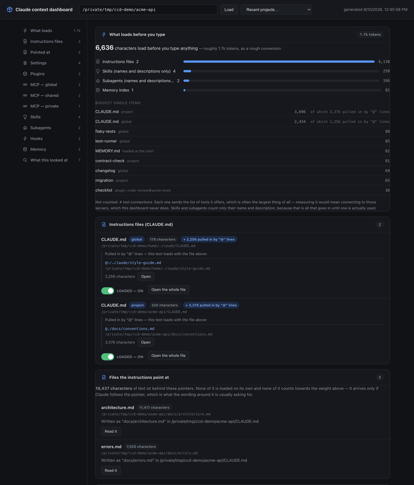
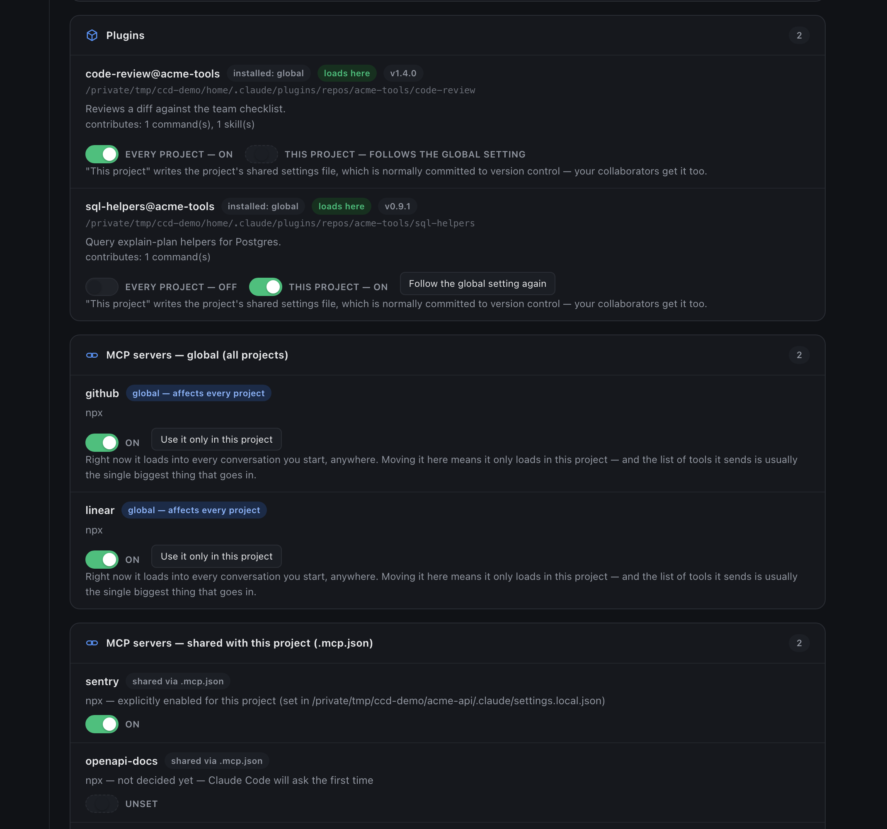

# Claude context dashboard

A local dashboard showing everything Claude Code loads when you start working in a project folder — instructions files, settings and permissions, plugins, MCP servers, skills, subagents, hooks and memory — with a switch on each one and an editor for every file it lists.

It runs as a small local web server rather than a hosted page because it reads files on your machine (`~/.claude`, `~/.claude.json`, and the project's own `.claude/` folder).





> **It writes to your real Claude Code config.** Every switch and every save changes the files Claude Code actually reads. Each write copies the old file to `~/.claude-context-dashboard/backups/` first and the editor can put a copy back, though the folder is trimmed to the last 20 copies of any one file and 50 MB in all. Even so: the formats it writes were read off a real installation of **Claude Code 2.1.x** (macOS, September 2026), not from a published schema, so a later version of Claude Code could change them under it. Everything on the page is readable without pressing a single switch.

## Install and run

Node 18 or newer. No dependencies, no build step.

```bash
git clone https://github.com/jpripamonti/claude-context-dashboard.git
cd claude-context-dashboard
node bin/cli.js            # inspects the current directory
```

Run `npm link` once inside the clone to get a `claude-context` command anywhere:

```bash
claude-context                                  # inspects the current directory
claude-context --path /path/to/other/project    # inspect a different project
claude-context --port 5000                      # default is 4317
claude-context --no-open                        # don't auto-open the browser
```

It opens `http://localhost:4317`. You can switch projects from the page itself — by typing a path or picking one from Claude Code's own project history — or by opening `?path=/some/project`. On macOS, `macos/build-launcher.sh` builds a double-clickable launcher that asks for the folder first.

## What it shows

- **What loads before you type** — how much each thing adds at startup, in characters and rough tokens, biggest first. Tool connections are not counted: measuring the tool list they send would mean connecting to them, which this never does.
- **Instructions files** — the global `CLAUDE.md`, the project's, the ones in between, and every file their `@` lines pull in, each as a row of its own, including the lines that bring nothing.
- **Files the instructions point at** — the other kind of pointer, the one written in prose. Claude Code does not load these, so they are listed apart and never counted as weight.
- **Settings & permissions** — all four settings layers separately, each setting in words instead of raw JSON, permission rules added and removed one at a time.
- **Plugins, MCP servers, skills, subagents, hooks, memory** — each with the file that decided it. MCP servers are split into the three scopes Claude Code really uses.
- **What this looked at** — every file the scan read, and what it did not read and why, built from the same paths the scan itself used.

## What it changes

Switching a skill, subagent, instructions file or memory note off renames it; nothing in it is touched, and nothing is backed up because nothing is overwritten. A plugin switch writes one of the two shared settings files, global or the project's own, depending on which switch you press. A switch for a server shared through `.mcp.json` writes wherever that decision is currently being made — the row says which file that is — except when that file applies to every project, where it writes the project's own settings instead. A switch labelled "this project" never writes a file that applies to every project. A hook switched off is parked in `~/.claude-context-dashboard/parked.json` rather than left as an unknown key in a settings file.

Every write that replaces content backs the file up first, is atomic, keeps the original permission bits, and is refused if the file changed on disk since it was read (a running Claude Code session may have written it). The editor's **Earlier versions** list puts any backup back.

Exactly what each switch does, and everything it refuses to do, is in [docs/reference.md](docs/reference.md).

## Does it match your machine?

Claude Code publishes no schema for the files this reads and writes. Their shapes
were worked out by reading one installation — Claude Code 2.1.x on macOS,
September 2026 — so the honest answer for any other machine is: probably, but
nobody has checked. This checks it:

```bash
node bin/check-config.js
```

It opens files for reading and writes nothing; the only other process it starts
is `claude --version`. Every line is numbered to match
[docs/schema-assumptions.md](docs/schema-assumptions.md), which says what breaks
if that assumption is wrong on your machine — including the lines it can only
mark "not checked", because what Claude Code *does* with a file cannot be settled
by reading files. The output carries counts, key names and types: nothing read out
of a file, no server names, and no paths beyond the name of the project folder, so
it is safe to paste as it stands.

If a line comes back `MISMATCH`, that is the one thing this project cannot find
out on its own. You already have an agent that can describe it; paste this to
your own Claude Code, in this repo:

```
Run `node bin/check-config.js` and read docs/schema-assumptions.md.

For every line it marks MISMATCH, open the file that assumption names on this
machine and describe the shape it actually has: which keys, of what types,
nested how, and how that differs from what the assumption says.

Report shapes only. Redact every value — tokens, API keys, absolute paths,
project names, MCP server names — and keep key names and types.

Do not modify anything: not this repo, not my Claude Code config. I want a
description I can paste into a bug report, not a fix.
```

Then open an issue at [github.com/jpripamonti/claude-context-dashboard/issues](https://github.com/jpripamonti/claude-context-dashboard/issues) with what it gives you. That is how this stops being tested on
exactly one computer.

## Safety

- The server listens on `127.0.0.1` only. Every API request needs a matching `Host`/`Origin`, and writes additionally need a JSON content type, so another site open in your browser can neither read your settings nor drive the switches.
- It displays what is in the files, including any keys in an MCP server's `env` block. Keep it to your own machine.
- Any local program that can reach the port can change config for any project — but a program running as you could already write those files directly.

## Limitations

- A static, before-you-start report. Live usage during a session is Claude Code's own `/context`.
- A change applies to the **next** session you start, not one already running.
- Enterprise-managed settings are not scanned; the page says whether one exists.
- Nested instructions files are found one folder deep inside the project.

The rest are listed in the [reference](docs/reference.md#known-limitations).

## Tests

```bash
npm test
```

Two plain Node scripts, no dependencies, both against a throwaway `HOME`, so your real config is never touched. They cover every write path and drive the editor the way the page does, against a real server and real files.

## Status

A personal tool, published in case it is useful to someone else. It is used daily against one person's config on macOS, which is also the extent of its field testing. MIT licensed, no warranty; bug reports are welcome but may sit for a while. Known rough edges are in [PENDING.md](PENDING.md).
